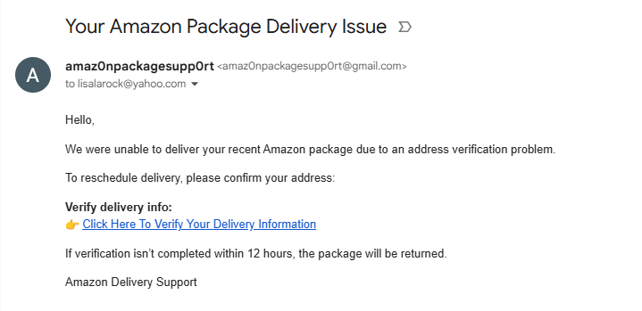
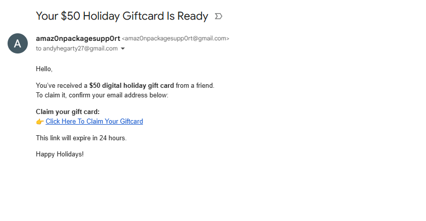
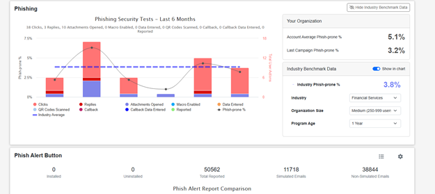
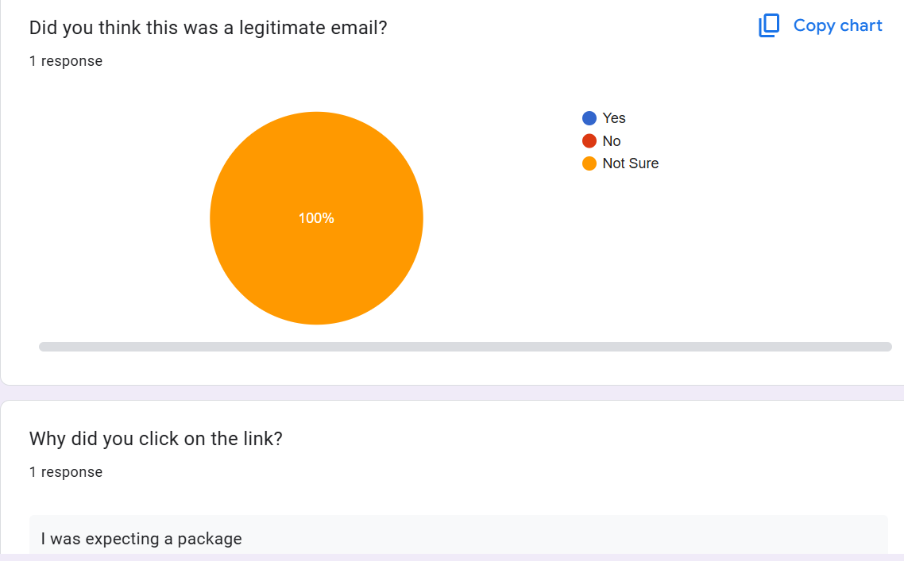
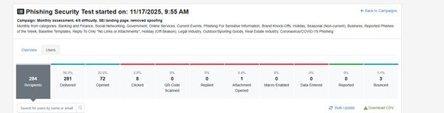

# Phishing
BFOR519 Final Project - Phishing Simulation

## Project Overview 
The subject I chose to work on for this project is phishing. I used a real world example of the phishing tests that we conduct as an IT team for the company I work at, and on top of that, I created my own phishing test and sent it to close friends and family with their consent which I got several weeks ago. Simulated phishing tests are conducted within organizations to ensure that employees remain vigilant and are careful of what links they click, what files they download, and what information they give out. Phishing is one of the most used and most successful forms of attacks used by cyber criminals. I work at an incredibly small organization, around 300 employees, and we receive an excess amount of phishing emails on a weekly basis. There are simple phishes that request for you to call a number to cancel a payment you made, or more in-depth phishes that prompt you to a fake Microsoft login page where you enter in your company credentials. Seeing the mass amounts of phishing emails we receive daily is what initially sparked my interest to this topic, and that's why I chose it for my final.

For the first part of my project, I created a realistic phishing email themed around holiday giftcards and Amazon delivery issues. It is the holiday season right now, millions of emails are being sent to inboxes offering holiday deals, and most people are ordering gifts for their friends and family. It isn't unusual to receive legitimate e-giftcards delivered straight to your email, or receive emails that the package you ordered has been delayed, but the question is, are those emails legit? In the emails I sent, there was a hyperlink that redirected the participants to a Google Form to fillout where they explain what made them think the email was legitimate and allows them to explain any red flags they may have had while reading the email. 

The second part of my project was sent a simulated phishing test sent out to the majority of employees at my company using a cybersecurity training platform that simulates phishing tests called KnowBe4. Typically, our Security Analyst and Senior IT Tech handle the monthly phishing tests but they allowed me to take a more hands on approach as well as further analyzing the data so that I can use it for this project. KmowBe4 sends out randomized simulated phishing emails to employees and monitors who opens the email, who clicked on a link in the email, and who opened the attachments. The links typically bring you to a page explaining that you have opened a simulated phishing email, shows the signs that you should've looked for before clicking any links or attachments, and gives a brief lesson on how to avoid phish emails in the future.

The primary objective of this project was to track the behavior of multiple users when opening a simulated phishing email. I wanted to see the reaction of a "too good to be true" email, and the reaction of an email that may cause panic because something went wrong. When being prompted with over excitement or increased stress, do people ignore the suspicious red flags within the email, or will they notice the red flags and proceed with caution. 

## Project Relevance
As stated earlier, phishing is one of the most persistent threats in the cyber world, and can be extremely damaging if you are not cautious. Not only are phishing emails dangerous in and of itself, but they frequently are a beginning stage of larger attacks. Phishing emails can be used as a step in the door to steal further credentials, take over the entirety of a users accounts, comprimise business credentials and emails, and even deploy ransomware. Bad actors are constantly developing new techniques to try and gain unauthorized access to many things, and we see phishing emails constantly evolve. No less then an hour ago at work we received a phish alert so I investigated it, the email looked extremely legit and brought you to a fake Microsoft sign in page, the only off thing was the URL. If you clicked forgot my password, it brought you to the Microsoft website, and all of the other hyperlinks were apart of the phish. Phishing simulations are crucial because while bad actors advance their techniques, organizations, users, and all people in general need to become more and more educated to reduce the risk of falling for a phish.

Human decision-making plays a major role within phishing attacks. Being able to tell whats real vs whats fake is crucial and can make the difference between being safe on the internet, or losing access to your entire internet presence. Many email providers provide email filtering which can help weed out a lot of spam, but if the email makes it into your inbox, you need to be able to tell the difference. This project is extremely relavent because humans make decisions every second of their life. Often times you hear people say if it's too good to be true, it probably isn't true. That plays a huge role in decision making when clicking on a phish. In my simulated phishing scenario, I sent out an email to 5 people offering a free $50 Amazon giftcard. There is no sign of who the giftcard was from, the email just states it was "from a friend". A simple hover over the hyperlink would show you that it is a phish, but some people may click the link right away because they want the free $50, who wouldn't? But clicking that free $50 could cost you.

I chose this topic because it is extremely relavent in todays society, everyone is reliant on technology, and everyone has an email or a cellphone number to receive phishing messages to. Being able to educate close friends and family that may be unaware of the threats that are posed from a phishing email is extremely important as well. Oftentimes the bad actors target vulnerable groups of people. such as people who are older and may not be familiar with technology. To expand on this, most organizations have threat teams or people who investigate the consequences of someones actions when they click on a phish. I'd say about once a month I have to get on the phone with someone because they clicked on a malicious URL from a phishing email and I have to make sure they didn't enter in any passwords or download anything. Out of precaution, we have a set of steps that we do even if they claim they didn't do anything and 9 times out of 10 we reset their password and actively monitor their account to make sure there are no malicious sign ons. Having a simulation of malicious emails allows people to have an idea of what to expect, what not to click, and what to do if they did click a link or download something malicious.

## Methodology
### Personal Simulated Phishing Test
#### Setup & Environment
- I received consent from 10 volunteers to send a phishing email randomly within 30 days.
- I created a new Gmail to send the simulated emails from.
- I also created a Google Form to track who clicked on the phish, if anyone at all.
#### Tools, Framework & Datasets Used
- I used Gmail to send the phishing emails, as stated previously.
- I used Google Forms to track the data, see if anyone clicked the link, and explain why they did.
#### Architecture / Workflow
- Created a phishing style email, one was about an incorrect Amazon delivery, the other was about a free $50 giftcard.
- Created a simple Google Form with three questions that confirmed the participant clicked the link.
- I created hyperlinks in the email so that the user wouldn't just see a link to a Google Form when reading the email.
- I sent the emails out to the participants, 5 emails were the free $50 giftcard, the other 5 were about an incorrect Amazon delivery.
- Lastly, I analyzed why the participants did or didn't click the link.
#### Step-by-Step Process 
- Drafted 2 simulated phishing emails, one was reward based, one was based off of urgency.
- Built a simple Google Form titled Simulated Phish.
- Added questions to the form asking for the participants name, did they think the email was legit, and why they clicked it.
- Hyperlinked the form in the emails I sent so that it didn't show the link to the form.
- Collected the responses I got from the form which showed how many participants clicked the email.
- Analyzed the data I received.

### KnowBe4 Simulated Phishing Test
#### Setup & Environment
- I was granted KnowBe4 Admin access to work on and analyze the monthly simulated phishing tests conducted.
- Ensured the dashboard was up-to-date to analyze the data.
#### Tools, Framework & Datasets Used
- KnowBe4 Security Platform
- KnowBe4 Phishing Campaign
- KnowBe4 Reporting & Analytics Dashboard
- List of updated employee emails in the company, new hires updated, old emails removed, etc.
#### Architecture / Workflow
- Reviewed our previous months phishing trends to see what we need to improve on.
- Launched the simulated phishing campaign to the assigned user group on our KnowBe4 Admin dashboard.
- Monitor to make sure all emails were delivered successfully.
- Analyzed the amount that we're open and the amount of links and attachments clicked.
- Document the results, and ensure users are informed if they clicked a phishing link so that it can prevent them from doing so in the future.
#### Step-by-Step Process
- Make sure the user list of employees is updated in the KnowBe4 library.
- Schedule the phishing campaign for a specific date.
- Launch the phishing campaign and monitor for results, allowing employees to interact with the emails without being informed there is a phishing simulation going on.
- Collect and analyze the data from the KnowBe4 dashboard.

## Results
### Personal Simulated Phishing Test
- Total Participants = 10
- Total Emails Opened = 5
- Total Clicks = 1
- Clickrate = 10%
- Reasoning = They were expecting an Amazon package that same day
- Feedback On The Phish Emails = 5 out of 10 people could tell it was fake solely based off of the email address that I sent it from. 4 out of 10 hovered over the link and realized that it didn't bring you to a verified source, i.e Amazon's website. 

### KnowBe4 Simulated Phishing Test
- Total Participants = 284
- Total Emails Opened = 72
- Total Clicks = 8
- Clickrate = 2.8%
- Attachments Opened = 1
- Feedback = Many employees reported the suspected phish emails to ITHelp for further investigation, however, some clicked on the links or attachments believing the email was legitimate.

## Conclusion
This phishing simulation project was extremely eye opening and educational. It demonstrated how bad actors can trick innocent people into clicking on links and attachments in emails, whether it is because the email looks extremely legitimate, or because the person is receiving a package that same day by the luck of the draw. I believe this project demonstrates the great risk that humans pose as vulnerabilities to their own cybersecurity presence on the internet, or the presence of the company they work for. Humans rely on stimulations and feelings every second of their life, if you receive an email saying you won free money, and you really need that money, you may not think twice and blindly click. That same thing goes for stress, if you are expecting a package to be delivered and you receive an email stating something went wrong, you may become extremely stressed and blindly click. Not taking the time to confirm an email is legitimate could be the difference between a bad actor gaining full access into your life or you remaining safe on the internet. It may sound extreme, but it is the truth.

Some potential next steps would be to make sure everyone remains educated on phishing emails, especially those who clicked the links or attachments within both demonstrations of this project. Something that I think would be interesting would be to compare which phishing variations get the most interactions and clicks, is it stress based, reward based, or totally unrelated. Overall, continuing simulated phishing tests at companies is crucial because all it takes is one mistake and the integrity of the company or person is at risk.
